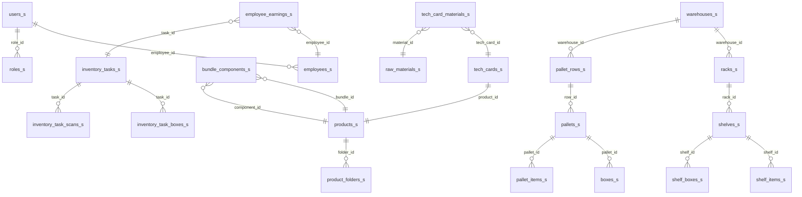

# База данных

PostgreSQL 5.42.100.180:5432, database "bd2". Все таблицы с суффиксом `_s`.

## ER-диаграмма (основные связи)

## Таблицы по категориям

### Пользователи и роли
| Таблица | Описание | Ключевые поля |
|---|---|---|
| `employees_s` | Сотрудники | full_name, position, phone, gra_balance, external_employee_id |
| `users_s` | Учётные записи | username, password_hash, role (admin/manager/employee), employee_id |
| `roles_s` | Роли с правами | name, permissions (JSONB) |

### Товары и материалы
| Таблица | Описание | Ключевые поля |
|---|---|---|
| `products_s` | Каталог товаров | name, article, entity_type (product/bundle), barcode_list, stock, folder_id |
| `product_folders_s` | Иерархия папок товаров | name, parent_id, full_path |
| `bundle_components_s` | Состав бандлов | bundle_id, component_id, quantity |
| `raw_materials_s` | Сырьё/материалы | name, unit, category (ingredient/packaging), stock, buy_price, material_group |
| `material_recipe_s` | Рецепты материалов | material_id, ingredient_id, quantity |
| `tech_cards_s` | Техкарты производства | product_id, output_quantity, cost |
| `tech_card_materials_s` | Строки техкарт | tech_card_id, material_id, quantity |

### Стеллажный склад
| Таблица | Описание | Ключевые поля |
|---|---|---|
| `warehouses_s` | Склады | name, warehouse_type (fbs/fbo/both/visual/visual_pallet) |
| `racks_s` | Стеллажи | warehouse_id, name, number, barcode_value |
| `shelves_s` | Полки | rack_id, name, number, barcode_value, uses_boxes |
| `shelf_items_s` | Товары на полках | shelf_id, product_id, quantity |
| `shelf_boxes_s` | Коробки на полках | shelf_id, position, barcode_value, product_id, quantity, box_size, status |
| `shelf_box_items_s` | Товары в коробках полок | shelf_box_id, product_id, quantity |
| `shelf_movements_s` | Аудит операций полок | shelf_id, product_id, operation_type, quantity_before/after/delta |

### Паллетный склад
| Таблица | Описание | Ключевые поля |
|---|---|---|
| `pallet_rows_s` | Ряды паллетов | warehouse_id, number, name |
| `pallets_s` | Паллеты | row_id, number, barcode_value, uses_boxes |
| `boxes_s` | Коробки на паллетах | barcode_value, product_id, pallet_id, quantity, box_size, status (open/closed) |
| `box_items_s` | Товары в коробках | box_id, product_id, quantity |
| `pallet_items_s` | Россыпь на паллетах | pallet_id, product_id, quantity |

### Задачи и инвентаризация
| Таблица | Описание | Ключевые поля |
|---|---|---|
| `inventory_tasks_s` | Задачи | title, status, task_type (inventory/packaging), employee_id, shelf_id |
| `inventory_task_boxes_s` | Коробки в задаче | task_id, box_id, shelf_box_id, status |
| `inventory_task_scans_s` | Сканирования | task_id, product_id, scanned_value, quantity_delta |
| `scan_errors_s` | Ошибки сканирования | task_id, scanned_value, employee_note, resolved_at |

### Начисления GRACoin
| Таблица | Описание | Ключевые поля |
|---|---|---|
| `employee_earnings_s` | Записи начислений | employee_id, event_type, amount_delta, balance_before/after, rate_per_unit |

### Перемещения
| Таблица | Описание | Ключевые поля |
|---|---|---|
| `movements_s` | Универсальный лог | movement_type, product_id, quantity, from_*/to_* (pallet/shelf/box/employee) |
| `employee_inventory_s` | Инвентарь сотрудников | employee_id, product_id, quantity |

### Система
| Таблица | Описание | Ключевые поля |
|---|---|---|
| `settings_s` | Настройки | key, value |
| `system_errors_s` | Логи ошибок фронтенда | error_type, error_message, error_stack, page_url |
| `import_runs_s` | История импорта | status, products_count, errors_json |
