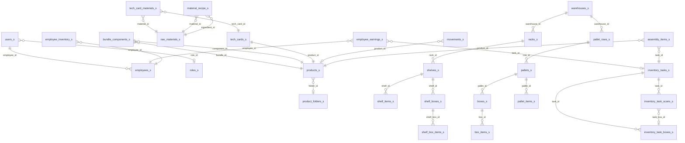

# База данных

PostgreSQL 5.42.100.180:5432, database "bd2". Все таблицы с суффиксом `_s`.

Схема определяется в `backend/src/db/schema.js` и применяется автоматически при старте сервера.

## ER-диаграмма (основные связи)

## Таблицы по модулям

### Пользователи и роли
| Таблица | Описание | Ключевые поля |
|---|---|---|
| `employees_s` | Сотрудники | full_name, position, phone, active, gra_balance, external_employee_id, department |
| `users_s` | Учётные записи | username, password_hash, role (admin/manager/employee), role_id, employee_id, active |
| `roles_s` | Роли с правами | name, permissions (JSONB массив строк) |

Предустановленные роли: Администратор, Менеджер, Сотрудник.

### Товары и материалы
| Таблица | Описание | Ключевые поля |
|---|---|---|
| `products_s` | Каталог товаров | external_id, name, code, article, entity_type (product/bundle), barcode_list, production_barcode, marketplace_barcodes_json (JSONB), stock, reserve, in_transit, quantity, folder_id, archived, source_json, sale_price, cost_price |
| `product_folders_s` | Иерархия папок | external_id, name, parent_id, full_path |
| `bundle_components_s` | Состав бандлов | bundle_id, component_id, component_external_id, quantity |
| `raw_materials_s` | Сырьё/материалы | external_id, name, code, article, unit, category (ingredient/packaging), material_group, stock, buy_price, min_stock, supplier, notes, archived, source_json |
| `material_recipe_s` | Рецепты материалов | material_id, ingredient_id, quantity, sort_order |
| `tech_cards_s` | Техкарты производства | product_id, external_id, name, output_quantity, cost, folder_path, archived, source_json |
| `tech_card_materials_s` | Строки техкарт | tech_card_id, material_id, quantity, sort_order |
| `import_runs_s` | История импорта | status (running/success/error), products_count, bundles_count, errors_json, source_dir |

### Стеллажный склад (FBS)
| Таблица | Описание | Ключевые поля |
|---|---|---|
| `warehouses_s` | Склады | name, external_id, warehouse_type (fbs/fbo/both/visual/visual_pallet/box), active, notes |
| `racks_s` | Стеллажи | warehouse_id, name, number, code, barcode_value |
| `shelves_s` | Полки | rack_id, name, number, code, barcode_value, uses_boxes |
| `shelf_items_s` | Товары на полках (россыпь) | shelf_id, product_id, quantity, updated_by |
| `shelf_boxes_s` | Коробки на полках | shelf_id, position, name, barcode_value, product_id, task_id, quantity, box_size, status, confirmed |
| `shelf_box_items_s` | Товары в коробках полок | shelf_box_id, product_id, quantity |
| `shelf_movements_s` | Аудит операций полок | shelf_id, product_id, operation_type (inventory/correction/stock_in/stock_out), quantity_before, quantity_after, quantity_delta, user_id, task_id, source, notes |

### Паллетный склад (FBO)
| Таблица | Описание | Ключевые поля |
|---|---|---|
| `pallet_rows_s` | Ряды | warehouse_id, number, name |
| `pallets_s` | Паллеты | row_id, number, name, barcode_value, uses_boxes |
| `boxes_s` | Коробки на паллетах | barcode_value, product_id, pallet_id, warehouse_id, task_id, name, quantity, box_size, status (open/closed), confirmed, is_remainder, remainder_shelf_id |
| `box_items_s` | Товары в коробках (мульти-продукт) | box_id, product_id, quantity |
| `pallet_items_s` | Россыпь на паллетах | pallet_id, product_id, quantity |

### Задачи и инвентаризация
| Таблица | Описание | Ключевые поля |
|---|---|---|
| `inventory_tasks_s` | Задачи | title, status (new/in_progress/completed/cancelled), task_type (inventory/packaging/bundle_assembly), employee_id, shelf_id, shelf_ids (JSONB), current_shelf_index, product_id, box_size, target_pallet_id, target_box_id, target_shelf_box_id, packing_phase, bundle_product_id, bundle_qty, assembly_phase, source_boxes (JSONB), dest_shelf_id, dest_pallet_id, created_by, notes |
| `inventory_task_boxes_s` | Коробки в задаче | task_id, box_id, shelf_box_id, sort_order, status (pending/in_progress/completed) |
| `inventory_task_scans_s` | Сканирования | task_id, product_id, product_external_id, scanned_value, quantity_delta, shelf_id, task_box_id |
| `scan_errors_s` | Ошибки сканирования | task_id, task_box_id, scanned_value, employee_note, user_id, resolved_at, resolved_by |

### Начисления GRACoin
| Таблица | Описание | Ключевые поля |
|---|---|---|
| `employee_earnings_s` | Записи начислений | employee_id, task_id, task_scan_id, task_box_id, shelf_id, box_id, shelf_box_id, product_id, event_type (inventory_scan/manual_adjustment/external_order_pick), reward_units, rate_per_unit, amount_delta, balance_before, balance_after, notes, created_by_user_id, source, source_marketplace, source_store_id, source_store_name, source_entity_type, source_entity_id, source_entity_name, source_article, source_product_name, source_marketplace_code, source_scanned_code, source_task_id |

### Перемещения
| Таблица | Описание | Ключевые поля |
|---|---|---|
| `movements_s` | Универсальный лог | movement_type, product_id, quantity, quantity_before, quantity_after, from_pallet_id, from_shelf_id, from_box_id, from_employee_id, to_pallet_id, to_shelf_id, to_box_id, to_employee_id, performed_by, source, notes |
| `employee_inventory_s` | Инвентарь сотрудников | employee_id, product_id, quantity |

### Сборка комплектов
| Таблица | Описание | Ключевые поля |
|---|---|---|
| `assembly_items_s` | Забранные/отсканированные товары при сборке | task_id, product_id, source_box_id, source_pallet_id, source_shelf_id, scanned_barcode, quantity, used_in_bundle (номер комплекта) |

### Система
| Таблица | Описание | Ключевые поля |
|---|---|---|
| `settings_s` | Настройки (key-value) | key, value |
| `system_errors_s` | Логи ошибок фронтенда | user_id, username, user_role, error_type, error_message, error_stack, page_url, component, http_status, request_url, request_method, response_data, browser_info, extra_json |
| `feedback_s` | Обратная связь от сотрудников | user_id, username, user_role, category, subcategory, description, transcript, screenshot_path, audio_path, page_url, browser_info, status, admin_notes, resolved_by, resolved_at |

## Триггеры

Автоматическое обновление `updated_at` через триггер `update_updated_at_s()` на таблицах:
`employees_s`, `users_s`, `product_folders_s`, `products_s`, `warehouses_s`, `racks_s`, `shelves_s`, `inventory_tasks_s`, `settings_s`, `raw_materials_s`, `tech_cards_s`.
