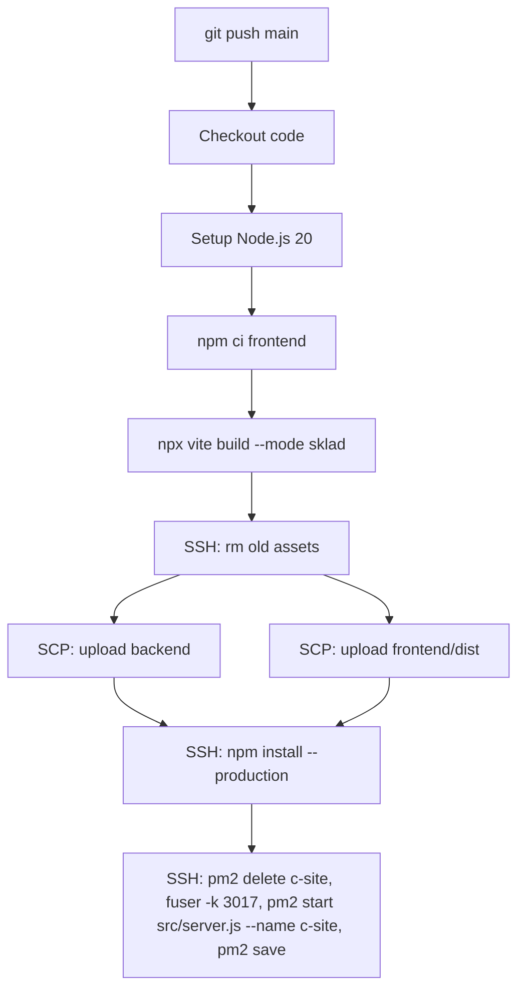

# Деплой

## Конфигурация

| Параметр | Значение |
|---|---|
| Сервер | 147.45.97.155 |
| Порт приложения | 3017 |
| PM2 process | `c-site` |
| База данных | 5.42.100.180:5432, db "bd2" |
| URL | http://147.45.97.155/sklad |
| Путь на сервере | `/var/www/bem-dev.ru/sklad/` |
| Node.js | 20 |

## CI/CD Pipeline

Файл: `.github/workflows/deploy.yml`

Триггер: `push` в ветку `main`.



### Шаги деплоя

1. **Checkout** — клонирование репозитория
2. **Setup Node.js 20** — с кэшем `frontend/package-lock.json`
3. **Install** — `cd frontend && npm ci`
4. **Build** — `npx vite build --mode sklad`
5. **Clean** — SSH: удаление старых ассетов `frontend/dist/assets/*`
6. **Upload backend** — SCP: `backend/src/`, `backend/package.json`, `backend/package-lock.json`
7. **Upload frontend** — SCP: `frontend/dist/`
8. **Install deps** — SSH: `npm install --production`
9. **Restart** — SSH: `pm2 delete c-site`, `fuser -k 3017`, `pm2 start src/server.js --name c-site`, `pm2 save`

## Переменные окружения (`backend/.env`)

| Переменная | Описание |
|---|---|
| `PORT` | Порт сервера (default: 3020) |
| `APP_BASE_PATH` | Базовый путь (например `/sklad`) |
| `DB_HOST`, `DB_PORT`, `DB_NAME`, `DB_USER`, `DB_PASSWORD` | Подключение к PostgreSQL |
| `JWT_SECRET` | Секрет для JWT |
| `JWT_EXPIRES_IN` | Срок жизни токена (default: 7d) |
| `MOYSKLAD_TOKEN` | Токен API МойСклад |
| `WB_TOKEN_1` | Токен Wildberries Content API (ИП Ирина) |
| `WB_TOKEN_2` | Токен Wildberries Content API (ИП Евгений) |
| `OZON_CLIENT_ID`, `OZON_API_KEY` | OZON магазин 1 (ИП И.) |
| `OZON2_CLIENT_ID`, `OZON2_API_KEY` | OZON магазин 2 (ИП Е.) |
| `EXT_DB_HOST`, `EXT_DB_PORT`, `EXT_DB_NAME`, `EXT_DB_USER`, `EXT_DB_PASSWORD` | Внешняя БД сотрудников |
| `CATALOG_SOURCE_DIR` | Путь к экспортам МойСклад |
| `SEED_ADMIN_LOGIN`, `SEED_ADMIN_PASSWORD` | Начальный логин/пароль admin |

> Все токены маркетплейсов хранятся ТОЛЬКО в `.env` на сервере. В репозитории их нет.

## Версионирование

Версия хранится в `frontend/src/components/layout/AdminLayout.jsx` (~строка 307):
```jsx
<p className="text-[10px] ...">v2.46.1</p>
```

При каждом обновлении инкрементировать:
- **patch** (+0.0.1) — баг-фиксы
- **minor** (+0.1.0) — новые фичи
- **major** (+1.0.0) — крупные изменения

## Связи

- [[Общая схема]] — архитектура
- [[МойСклад API]] — источник данных (MOYSKLAD_TOKEN)
- [[Wildberries API]] — проверка штрихкодов (WB_TOKEN_1, WB_TOKEN_2)
