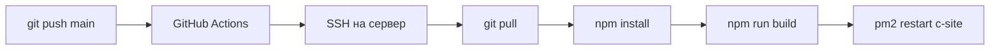

# Деплой

## Конфигурация

| Параметр | Значение |
|---|---|
| Сервер | 147.45.97.155 |
| Порт | 3017 |
| PM2 process | "c-site" |
| База данных | 5.42.100.180:5432, db "bd2" |
| URL | http://147.45.97.155/sklad |

## CI/CD Pipeline



## Версионирование

Версия хранится в `frontend/src/components/layout/AdminLayout.jsx` (~строка 231):
```jsx
<p className="text-[10px] text-gray-300 ...">v2.4.2</p>
```

При каждом обновлении — инкрементировать:
- **patch** (+0.0.1) — баг-фиксы
- **minor** (+0.1.0) — новые фичи
