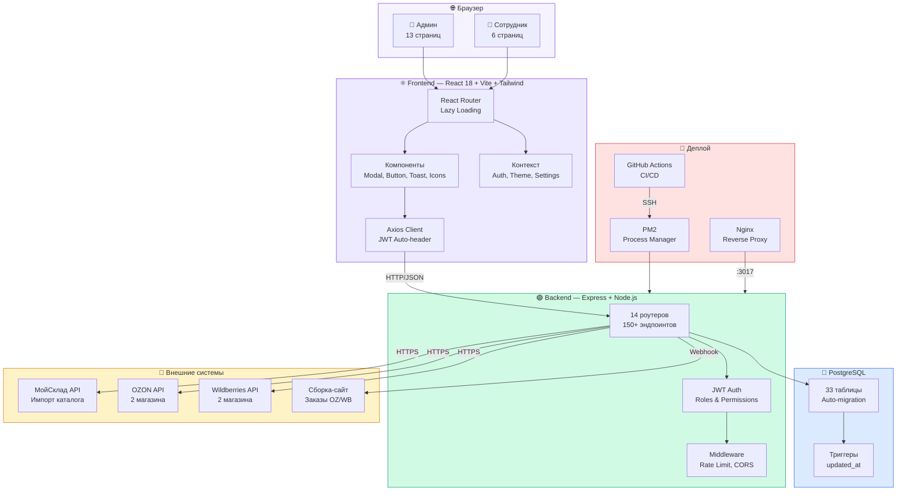
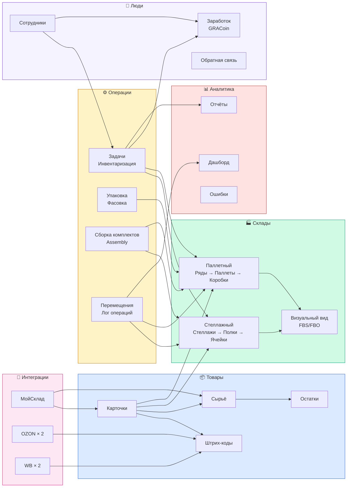
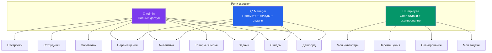

# Карта системы GRAсклад

## Архитектура — общий вид

## Модули и связи

## Пользовательские роли

## Связи

- [[Общая схема]] — стек технологий
- [[База данных]] — ER-диаграмма
- [[API эндпоинты]] — все роуты
- [[Деплой]] — CI/CD pipeline
