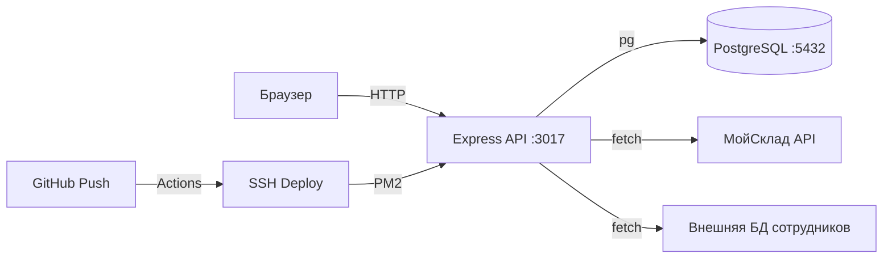

# Общая схема архитектуры

## Структура проекта

```
Sklad_control/
├── backend/
│   └── src/
│       ├── server.js          ← точка входа
│       ├── app.js             ← Express app, middleware
│       ├── db/
│       │   ├── pool.js        ← pg connection pool
│       │   └── schema.js      ← авто-миграция (33+ таблиц)
│       ├── routes/            ← 11 модулей роутов (~7000 LOC)
│       │   ├── auth.js
│       │   ├── products.js
│       │   ├── materials.js
│       │   ├── warehouse.js
│       │   ├── tasks.js
│       │   ├── fbo.js
│       │   ├── packing.js
│       │   ├── movements.js
│       │   ├── staff.js
│       │   ├── earnings.js
│       │   ├── errors.js
│       │   └── settings.js
│       └── middleware/
│           └── auth.js        ← JWT проверка
│
├── frontend/
│   └── src/
│       ├── pages/
│       │   ├── admin/         ← 15 страниц
│       │   └── employee/      ← 5 страниц
│       ├── components/
│       │   ├── layout/        ← AdminLayout, EmployeeLayout
│       │   ├── ui/            ← 13 компонентов
│       │   └── visual/        ← визуальные склады
│       └── LoginPage.jsx
│
└── docs/                      ← эта документация
```

## Потоки данных



## Авторизация

- JWT токен в `Authorization: Bearer` header
- Роли: `admin`, `manager`, `employee`
- Middleware `auth.js` проверяет токен на каждом запросе
- Пароли хешируются через bcryptjs

## Ключевые паттерны

- **Авто-миграция**: `schema.js` — CREATE IF NOT EXISTS + ALTER TABLE ADD COLUMN IF NOT EXISTS
- **Суффикс `_s`**: все таблицы проекта имеют суффикс `_s` для изоляции в общей БД
- **JSONB поля**: `source_json`, `permissions`, `marketplace_barcodes_json` — хранение сложных структур
- **Аудит**: `shelf_movements_s` и `movements_s` — полный лог всех операций
