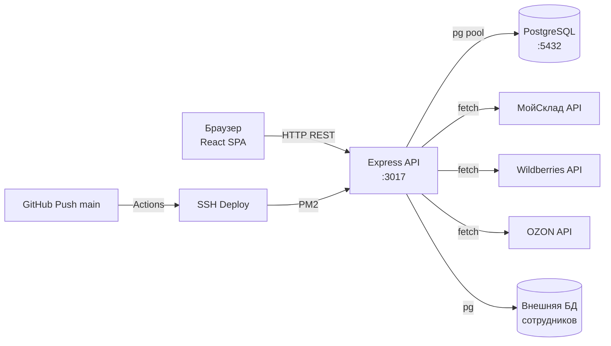

# Общая схема архитектуры

## Стек

| Слой | Технологии |
|---|---|
| Frontend | React 18, Vite, Tailwind CSS, Lucide Icons, React Router v6 |
| Backend | Node.js, Express, pg (PostgreSQL driver), JWT (jsonwebtoken), bcryptjs |
| БД | PostgreSQL (суффикс `_s` у всех таблиц) |
| Деплой | GitHub Actions → SSH (appleboy) → PM2 |

## Структура проекта

```
Sklad_control/
├── backend/
│   └── src/
│       ├── server.js          ← точка входа
│       ├── app.js             ← Express app, middleware, маршруты
│       ├── config.js          ← env-переменные (порт, БД, токены)
│       ├── db/
│       │   ├── pool.js        ← pg connection pool
│       │   ├── externalPool.js← pg pool для внешней БД сотрудников
│       │   └── schema.js      ← авто-миграция (CREATE IF NOT EXISTS)
│       ├── routes/            ← 14 файлов роутов
│       │   ├── auth.js
│       │   ├── products.js
│       │   ├── materials.js
│       │   ├── warehouse.js
│       │   ├── tasks.js
│       │   ├── fbo.js
│       │   ├── packing.js
│       │   ├── assembly.js
│       │   ├── movements.js
│       │   ├── staff.js
│       │   ├── earnings.js
│       │   ├── feedback.js
│       │   ├── syserrors.js
│       │   └── settings.js
│       ├── middleware/
│       │   └── auth.js        ← JWT проверка, requireAuth, requireAdmin
│       ├── utils/
│       │   ├── catalogImport.js ← импорт из МойСклад
│       │   ├── techCardImport.js← импорт техкарт
│       │   ├── syncFromOsite.js ← синхронизация из внешней БД
│       │   ├── logMovement.js   ← логирование перемещений
│       │   ├── password.js      ← bcryptjs hash/compare
│       │   └── jwt.js           ← signToken
│       └── scripts/
│           ├── exportMoySkladStockByCells.js
│           └── importEmployees.js
│
├── frontend/
│   └── src/
│       ├── App.jsx            ← маршруты, провайдеры
│       ├── pages/
│       │   ├── LoginPage.jsx
│       │   ├── admin/         ← 13 страниц
│       │   └── employee/      ← 6 страниц
│       ├── components/
│       │   ├── layout/        ← AdminLayout, EmployeeLayout
│       │   ├── ui/            ← Spinner, Toast, Badge, Modal, CopyBadge...
│       │   ├── feedback/      ← FeedbackModal
│       │   └── visual/        ← FBSVisualView, FBOVisualView, PalletWarehouseView
│       ├── context/           ← AuthContext, ThemeContext, AppSettingsContext
│       └── api/
│           └── client.js      ← axios instance
│
├── .github/workflows/
│   └── deploy.yml             ← CI/CD pipeline
│
└── docs/                      ← Obsidian документация
```

## Архитектурная диаграмма



## Авторизация

- JWT токен в `Authorization: Bearer` header
- Срок жизни токена: 7 дней (`JWT_EXPIRES_IN`)
- Роли: `admin`, `manager`, `employee`
- Middleware: `requireAuth` — проверка токена, `requireAdmin` — только admin, `requireAdminOrManager` — admin или manager
- Пароли хешируются через bcryptjs
- Rate limit: 15 попыток/мин на `/api/auth/login`

## Ключевые паттерны

- **Авто-миграция**: `schema.js` — `CREATE TABLE IF NOT EXISTS` + `ALTER TABLE ADD COLUMN IF NOT EXISTS`
- **Суффикс `_s`**: все таблицы проекта имеют суффикс `_s` для изоляции в общей БД
- **JSONB поля**: `source_json`, `permissions`, `marketplace_barcodes_json` — хранение сложных структур
- **Аудит**: `shelf_movements_s` и `movements_s` — полный лог всех операций
- **Lazy loading**: все страницы фронтенда загружаются через `React.lazy()`
- **Провайдеры**: `AuthContext`, `ThemeContext`, `AppSettingsContext`, `ToastProvider`
- **Code splitting**: Vite build с `--mode sklad`

## Связи

- [[База данных]] — все таблицы
- [[API эндпоинты]] — все роуты
- [[Деплой]] — CI/CD pipeline
