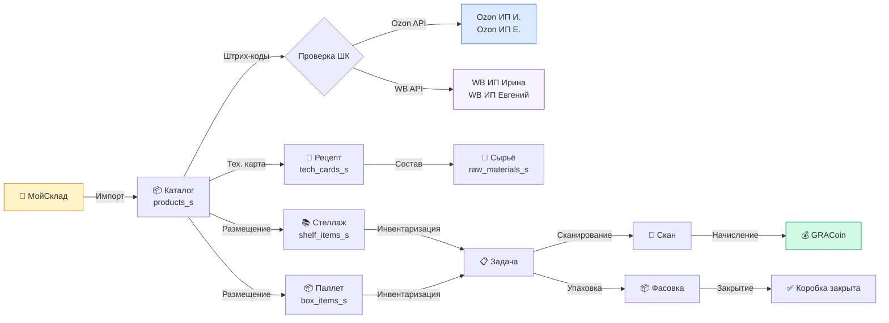
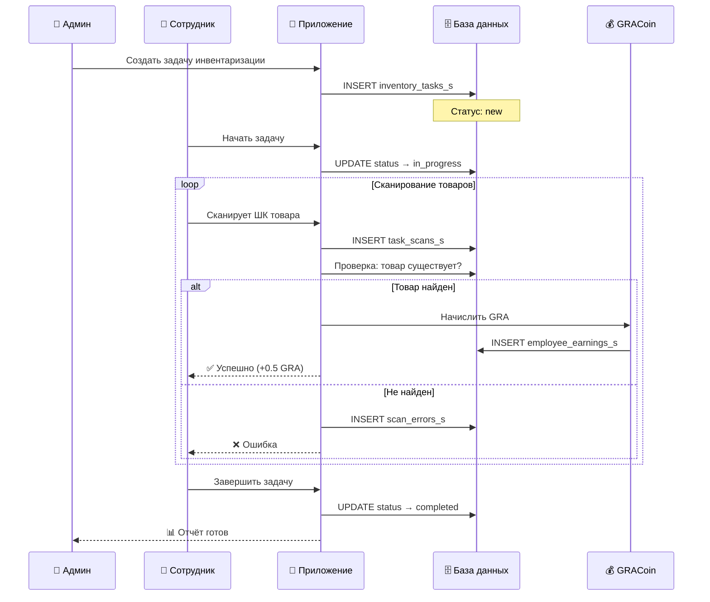
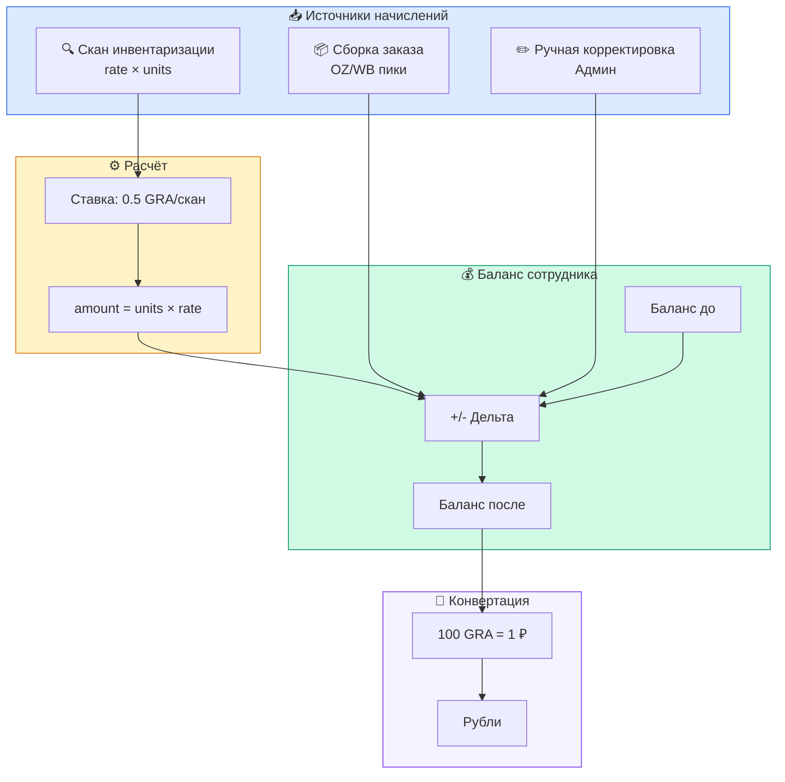
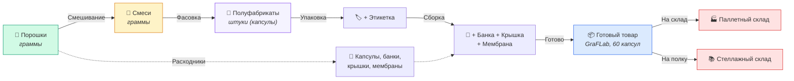

# Потоки данных

## Жизненный цикл товара

## Процесс инвентаризации

## Система заработка GRACoin

## Производственная цепочка

## Связи

- [[Карта системы]] — общая архитектура
- [[База данных]] — таблицы
- [[GRACoin]] — система заработка
- [[Словарь]] — терминология производства
