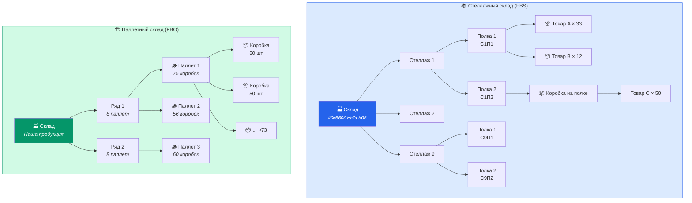
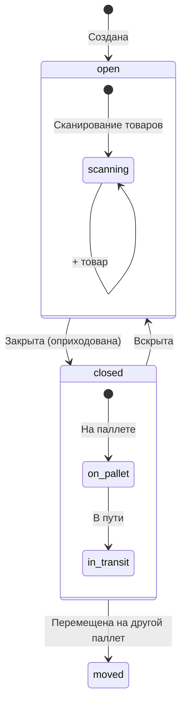
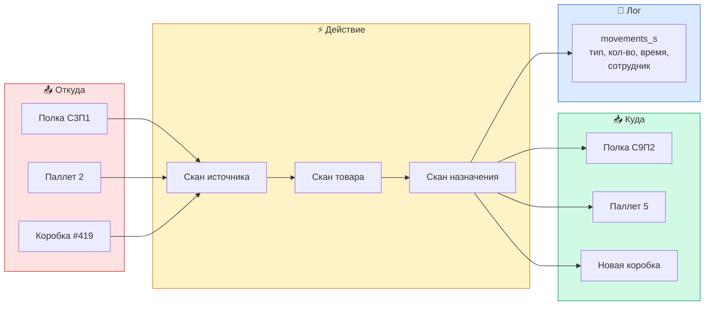

# Структура склада

## Иерархия хранения

## Статусы коробок

## Процесс перемещения

## Связи

- [[Стеллажный склад]] — FBS детали
- [[Паллетный склад]] — FBO детали
- [[Перемещения]] — логи
- [[Карта системы]] — общий вид
