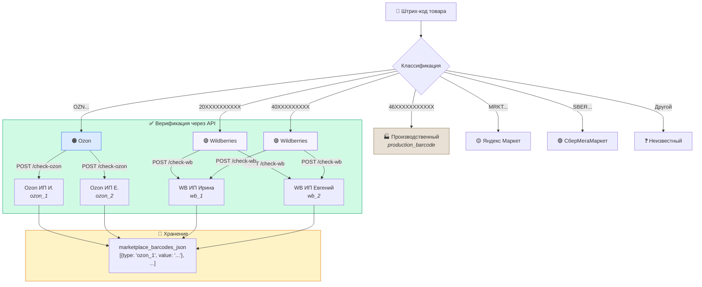
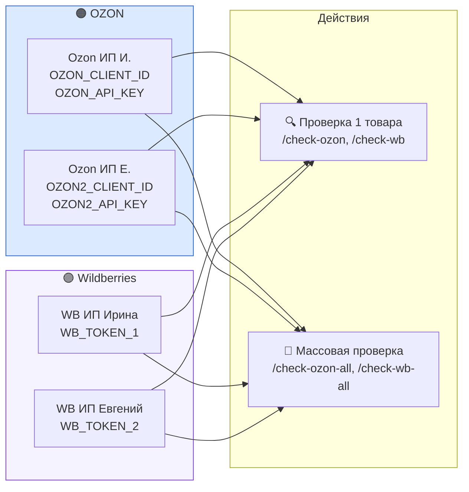

# Классификация штрих-кодов

## Типы штрих-кодов

```mermaid
graph TD
    BC["🔢 Штрих-код товара"] --> CHECK{"Классификация"}

    CHECK -->|"46XXXXXXXXXXX"| PROD["🏭 Производственный<br/><i>production_barcode</i>"]
    CHECK -->|"OZN..."| OZ["🟠 Ozon"]
    CHECK -->|"MRKT..."| YM["🟡 Яндекс Маркет"]
    CHECK -->|"SBER..."| SM["🟢 СберМегаМаркет"]
    CHECK -->|"20XXXXXXXXXX"| WB1["🟣 Wildberries"]
    CHECK -->|"40XXXXXXXXX"| WB2["🟣 Wildberries"]
    CHECK -->|Другой| UNK["❓ Неизвестный"]

    subgraph VERIFY["✅ Верификация через API"]
        OZ -->|"POST /check-ozon"| OZ1["Ozon ИП И.<br/><i>ozon_1</i>"]
        OZ -->|"POST /check-ozon"| OZ2["Ozon ИП Е.<br/><i>ozon_2</i>"]
        WB1 -->|"POST /check-wb"| WBI["WB ИП Ирина<br/><i>wb_1</i>"]
        WB1 -->|"POST /check-wb"| WBE["WB ИП Евгений<br/><i>wb_2</i>"]
        WB2 -->|"POST /check-wb"| WBI
        WB2 -->|"POST /check-wb"| WBE
    end

    subgraph STORAGE["💾 Хранение"]
        DB["marketplace_barcodes_json<br/>[{type: 'ozon_1', value: '...'}, ...]"]
    end

    OZ1 --> DB
    OZ2 --> DB
    WBI --> DB
    WBE --> DB

    style PROD fill:#e8e0d4,stroke:#8a7050
    style OZ fill:#dbeafe,stroke:#2563eb
    style WB1 fill:#f5f3ff,stroke:#7c3aed
    style WB2 fill:#f5f3ff,stroke:#7c3aed
    style VERIFY fill:#d1fae5,stroke:#059669
    style STORAGE fill:#fef3c7,stroke:#d97706
```

## 4 магазина

```mermaid
graph LR
    subgraph OZON["🟠 OZON"]
        O1["Ozon ИП И.<br/>OZON_CLIENT_ID<br/>OZON_API_KEY"]
        O2["Ozon ИП Е.<br/>OZON2_CLIENT_ID<br/>OZON2_API_KEY"]
    end

    subgraph WB["🟣 Wildberries"]
        W1["WB ИП Ирина<br/>WB_TOKEN_1"]
        W2["WB ИП Евгений<br/>WB_TOKEN_2"]
    end

    subgraph ACTIONS["Действия"]
        SINGLE["🔍 Проверка 1 товара<br/>/check-ozon, /check-wb"]
        BULK["🔄 Массовая проверка<br/>/check-ozon-all, /check-wb-all"]
    end

    O1 --> SINGLE
    O2 --> SINGLE
    W1 --> SINGLE
    W2 --> SINGLE
    O1 --> BULK
    O2 --> BULK
    W1 --> BULK
    W2 --> BULK

    style OZON fill:#dbeafe,stroke:#2563eb
    style WB fill:#f5f3ff,stroke:#7c3aed
```

## Связи

- [[Товары]] — карточки с ШК
- [[Wildberries API]] — WB интеграция
- [[Потоки данных]] — общий поток
