# Сборка комплектов — Пошаговая инструкция

## Что это?
Сборка комплектов — задача, в которой сотрудник собирает готовые наборы (комплекты) из отдельных баночек. Например: комплект "Магний L-треонат 2 банки" = 2 одинаковые баночки Магния в одной упаковке.

---

## Часть 1. Админ: Создание задачи

### Шаг 1. Открыть раздел "Задачи"
- Зайти в админку → **Задачи** (в левом меню)
- Нажать кнопку **"+ Создать задачу"** (фиолетовая, справа вверху)

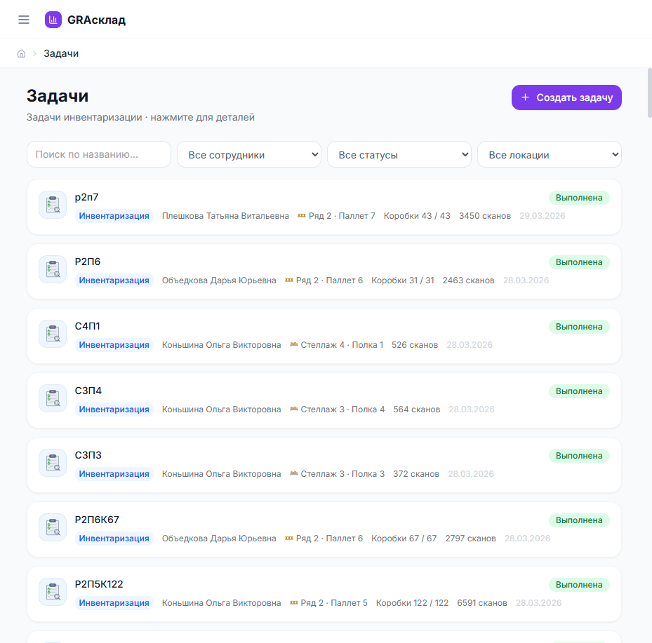

### Шаг 2. Выбрать тип "Сборка комплектов"
- В окне создания задачи нажать вкладку **"Сборка комплектов"**
- Форма изменится — появятся поля для сборки

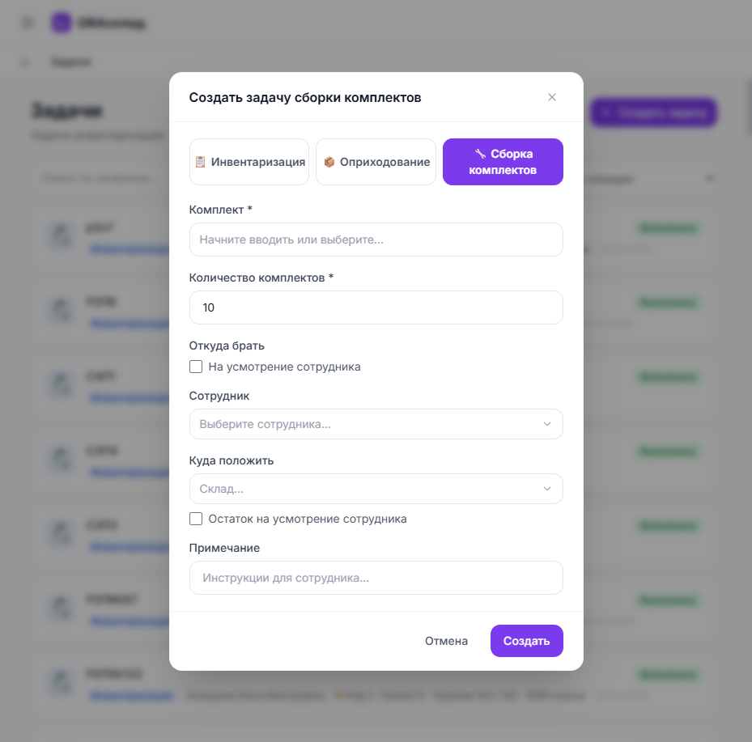

### Шаг 3. Заполнить форму
1. **Комплект** — начните вводить название (например "магний") → выберите из списка
   - После выбора покажется **состав комплекта** (какие баночки входят и сколько)
2. **Количество** — сколько комплектов нужно собрать (например: 3)
3. **Откуда брать** — система покажет все места, где лежит нужный товар:
   - Коробки на паллетах (паллетный склад)
   - Полки (стеллажный склад)
   - Нажмите на нужное место — появится зелёная галка
   - Можно поставить "На усмотрение сотрудника" — тогда сотрудник сам найдёт
4. **Сотрудник** — выберите кто будет собирать
5. **Куда положить** (необязательно) — выберите склад → стеллаж → полку (или паллет)

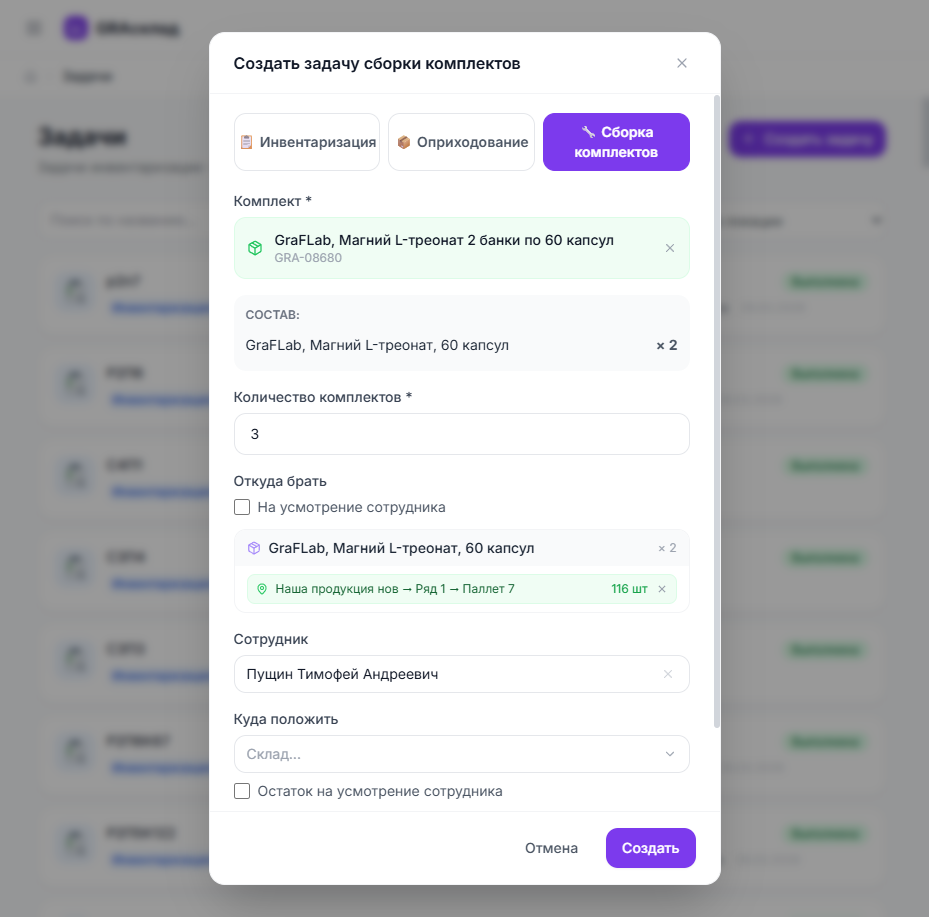

### Шаг 4. Нажать "Создать"
- Задача появится в списке со статусом **"Новая"**

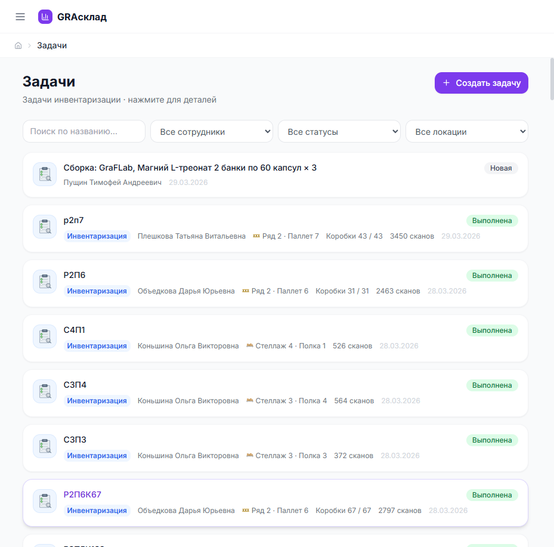

---

## Часть 2. Сотрудник: Выполнение задачи

У задачи 3 фазы: **Забор → Сборка → Размещение**

### ФАЗА 1: Забор товара

Цель: забрать все баночки с паллетного/стеллажного склада.

#### Шаг 1. Открыть задачу
- Зайти в **Задачи** (нижнее меню) → нажать на задачу сборки
- Увидите: название комплекта, сколько собрать, состав, где взять
- Нажать **"Начать забор товара"**

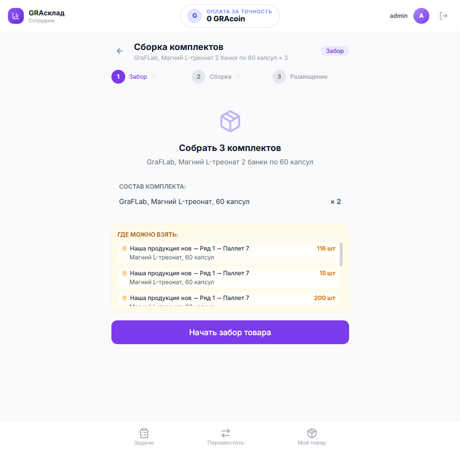

#### Шаг 2. Выбрать компонент
- Появится список компонентов (например: "Магний L-треонат, 60 капсул — 0/6")
- Нажать на компонент → раскроется список мест, где он лежит
- Нажать **"Забрать"**

#### Шаг 3. Отсканировать паллет или полку
- Появится поле **"ШК паллета или полки"**
- Сканером считать штрих-код паллета (или полки, если со стеллажа)
- Система покажет: "Наша продукция нов · Паллет 7"

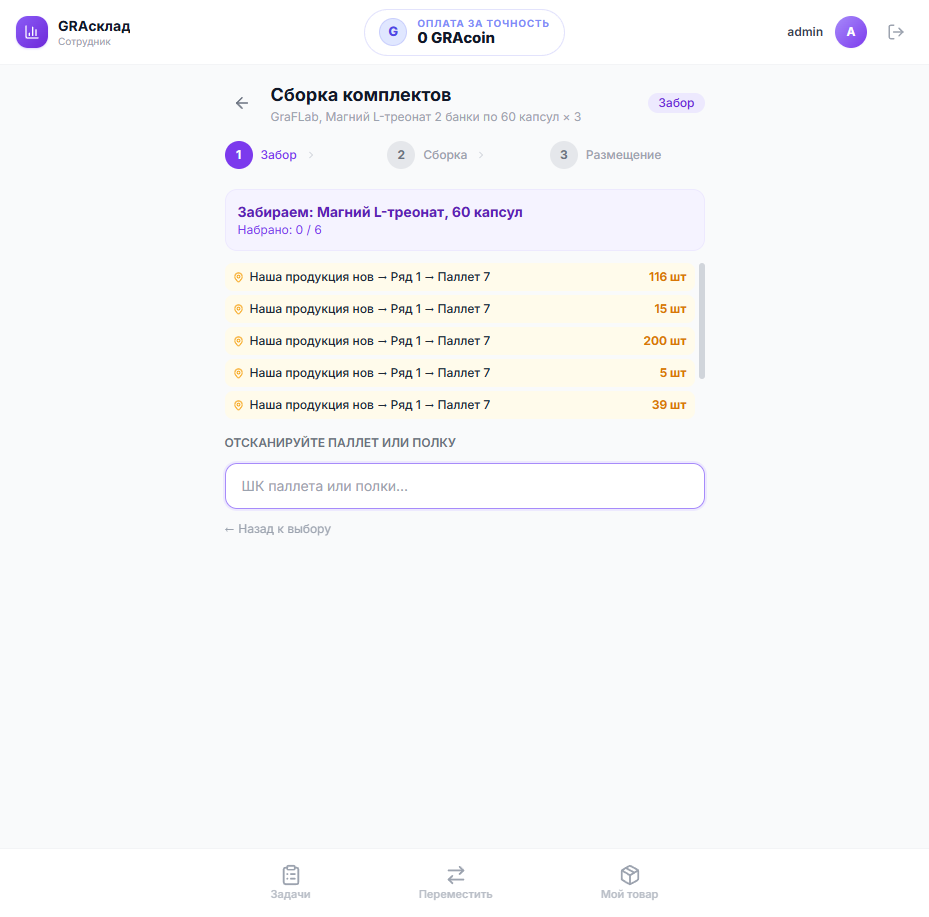

#### Шаг 4. Отсканировать коробку (только для паллета)
- Если сканировали паллет — появится поле **"ШК коробки"**
- Сканером считать штрих-код коробки
- Если сканировали полку — этот шаг пропускается

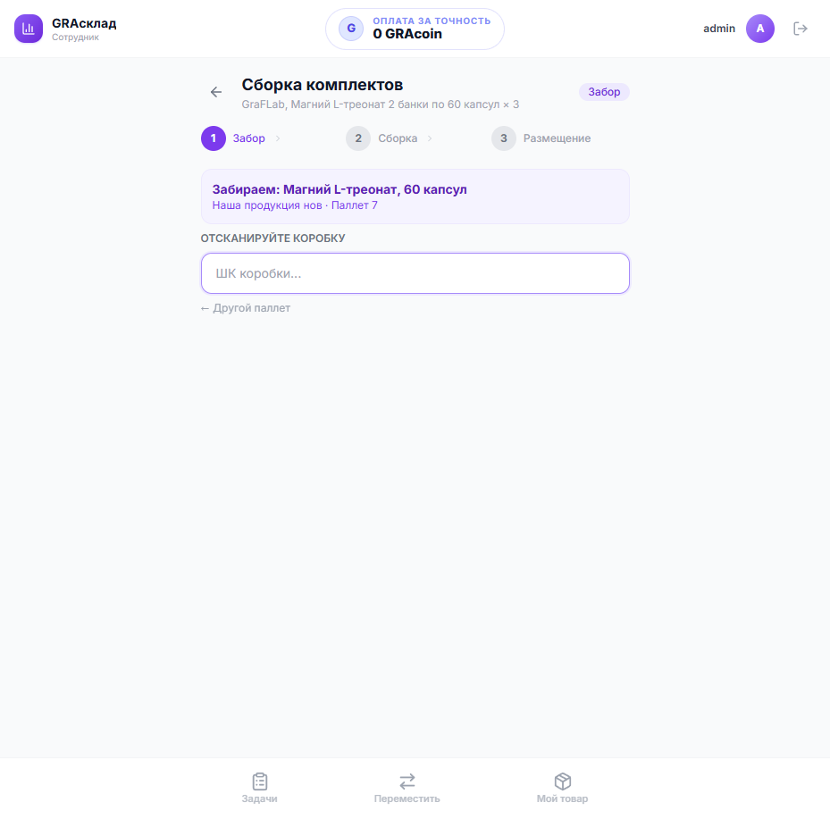

#### Шаг 5. Сканировать баночки
- Появится поле **"ШК баночки"**
- Сканируйте каждую баночку по одной
- Прогресс-бар показывает сколько набрано (например: 3/6)
- Зелёная карточка подтверждает каждый скан

#### Шаг 6. Когда всё набрано
- Появится кнопка **"Набрано — далее"** (зелёная)
- Если все компоненты набраны → кнопка **"Все забрано — начать сборку"**

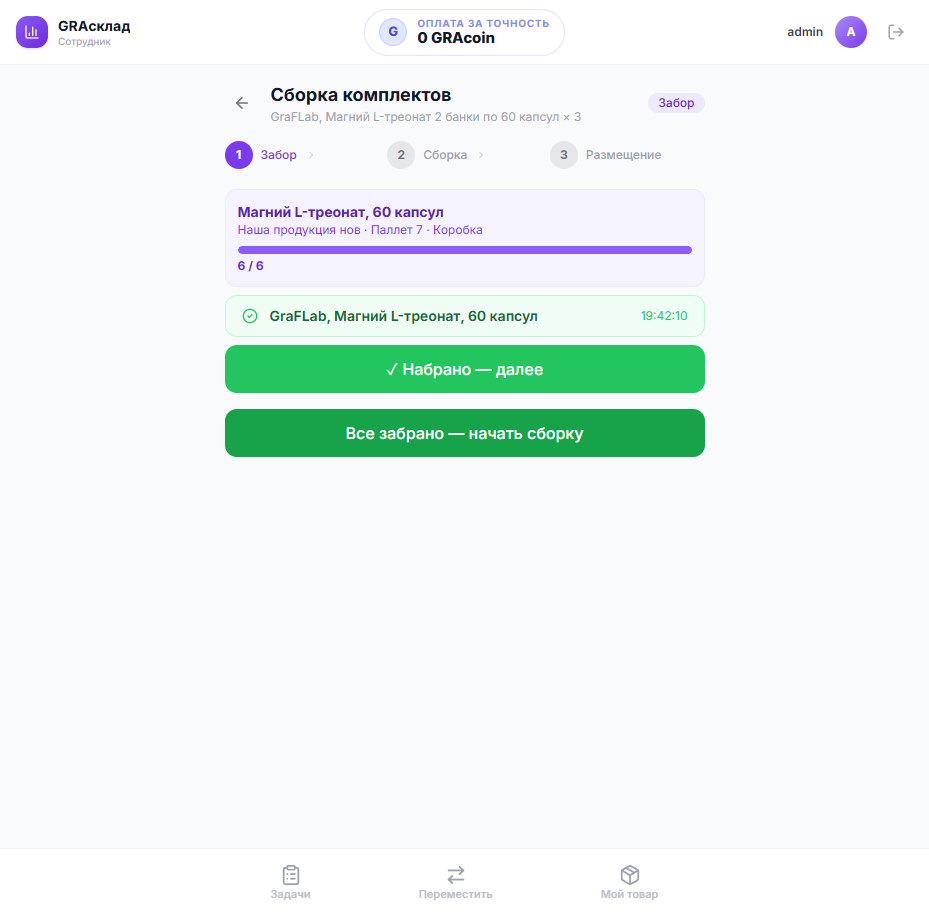

> **Совет:** Если обновили страницу — не волнуйтесь! Прогресс сохраняется, паллет и коробку заново сканировать не нужно.

---

### ФАЗА 2: Сборка комплектов

Цель: собрать каждый комплект, напечатать штрих-код, наклеить.

#### Шаг 1. Сканировать компоненты в комплект
- Экран показывает: **"Комплект 1 из 3"**
- Список компонентов с чекбоксами (пустые кружки)
- Сканируйте каждый компонент — кружок станет зелёным

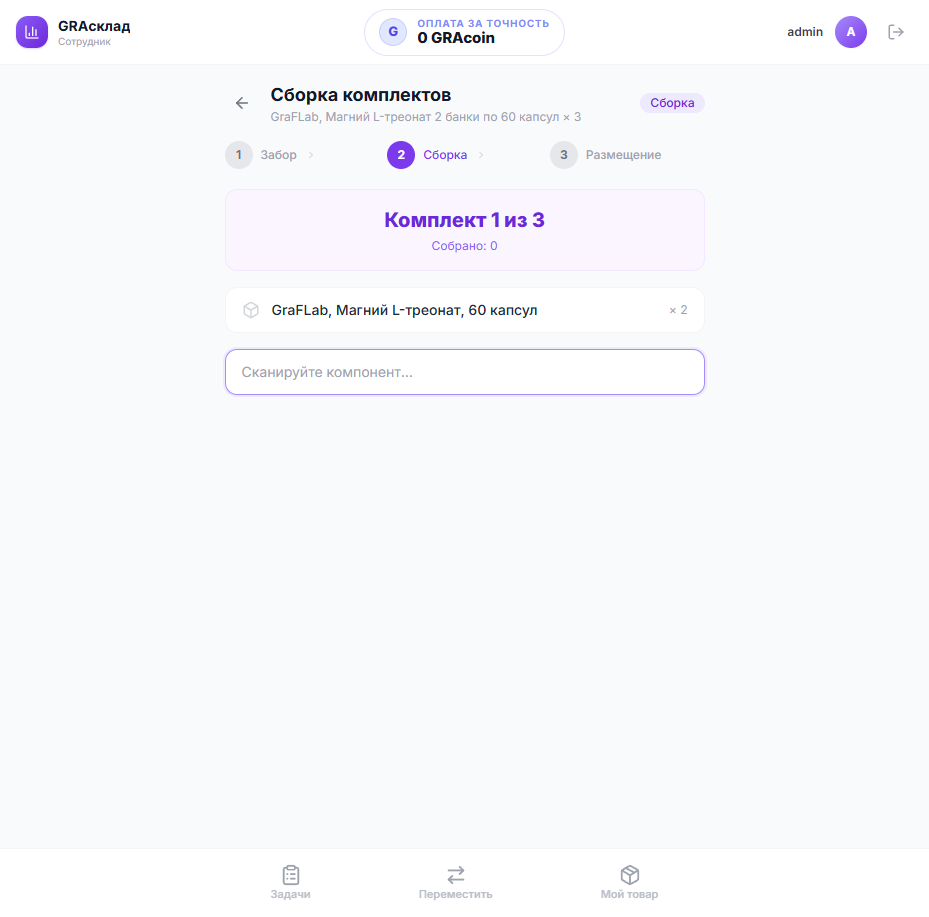

#### Шаг 2. Напечатать штрих-код
- Когда все компоненты отсканированы — появится **штрих-код комплекта**
- Нажать **"Печать"** — откроется окно печати
- Распечатать наклейку

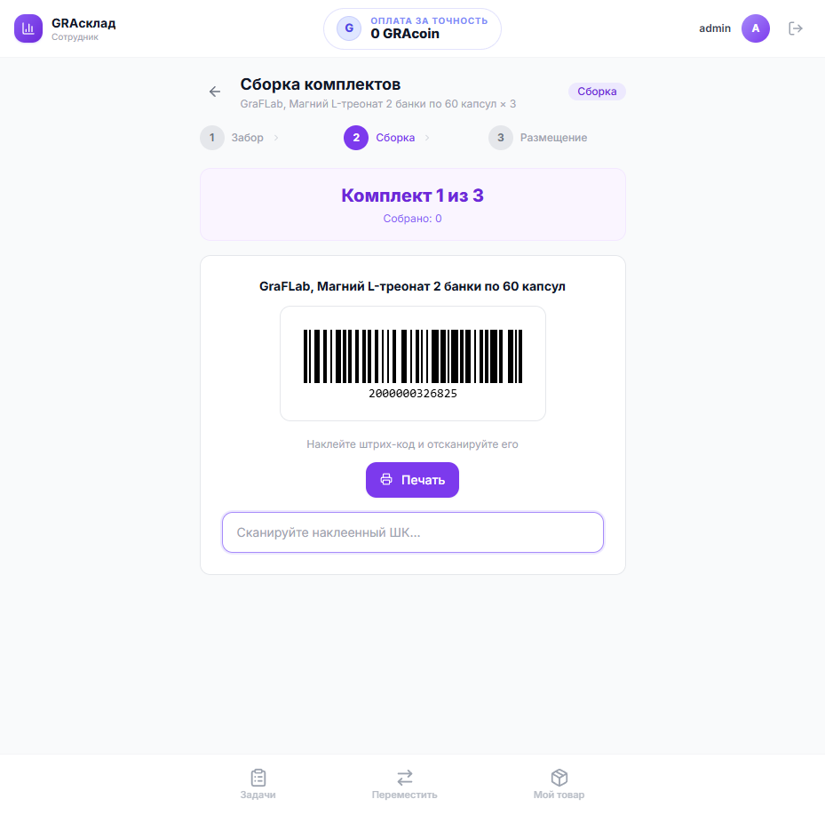

#### Шаг 3. Наклеить и отсканировать
- Наклейте штрих-код на комплект
- Отсканируйте наклеенный штрих-код
- Система подтвердит: **"Комплект 1/3 готов!"**
- Автоматически откроется следующий комплект

#### Повторять для каждого комплекта

---

### ФАЗА 3: Размещение

Цель: положить собранные комплекты на полку или паллет.

#### Шаг 1. Отсканировать место назначения
- Экран: **"Размещение комплектов — 0/3 размещено"**
- Отсканируйте штрих-код полки или паллета, куда кладёте комплекты

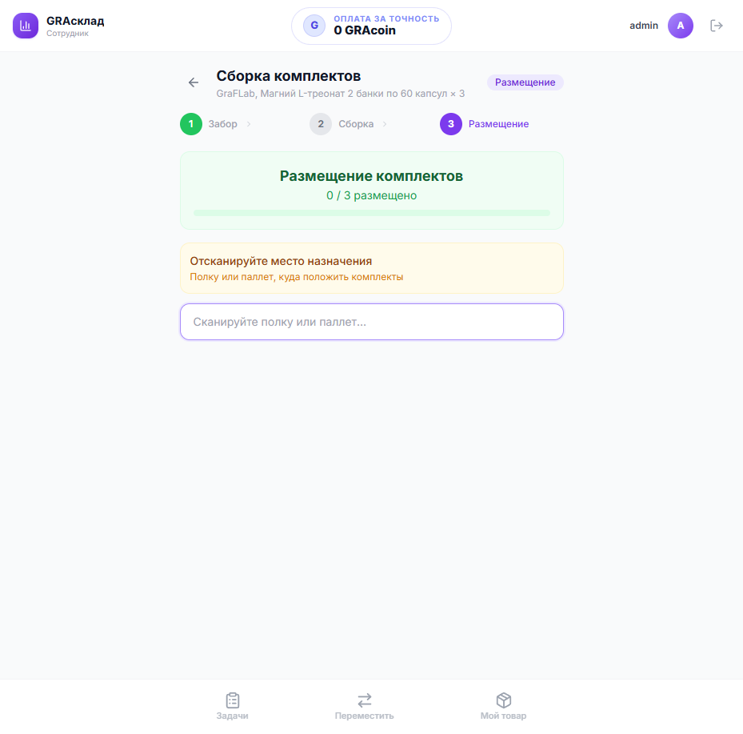
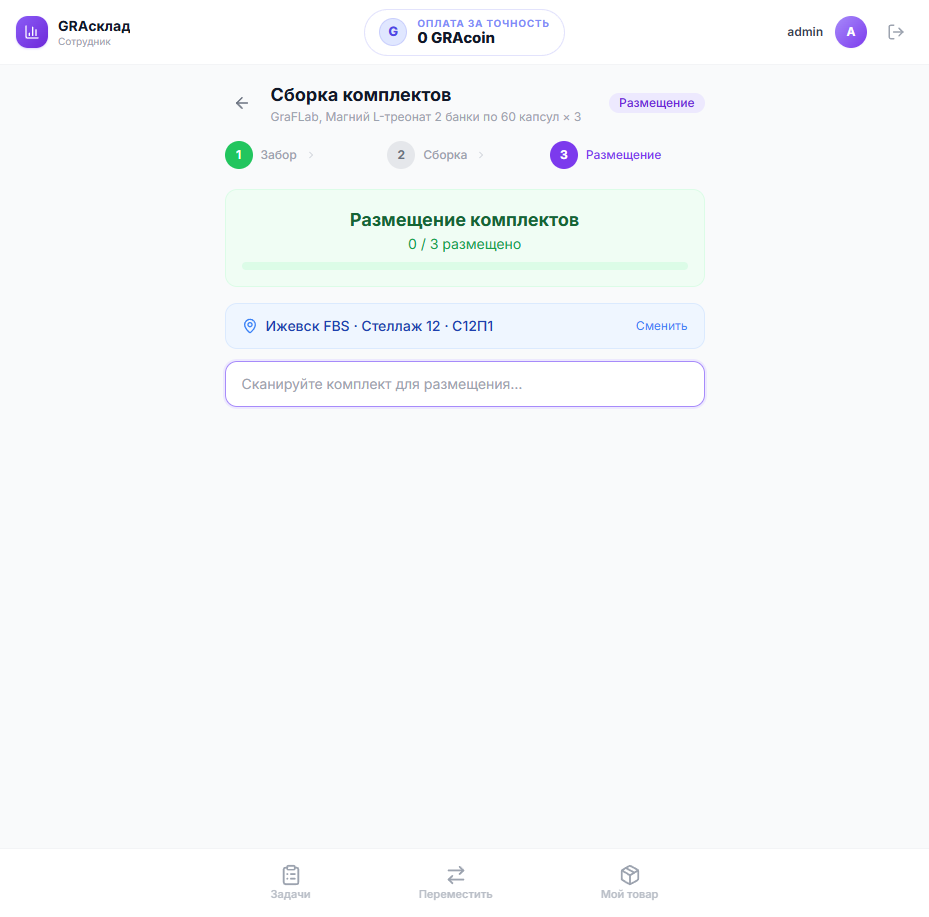

#### Шаг 2. Сканировать каждый комплект
- Отсканируйте ШК каждого комплекта (тот, что напечатали)
- Прогресс: 1/3... 2/3... 3/3

#### Шаг 3. Готово!
- Когда все размещены: **"Задача завершена!"**
- Кнопка **"К задачам"** возвращает к списку

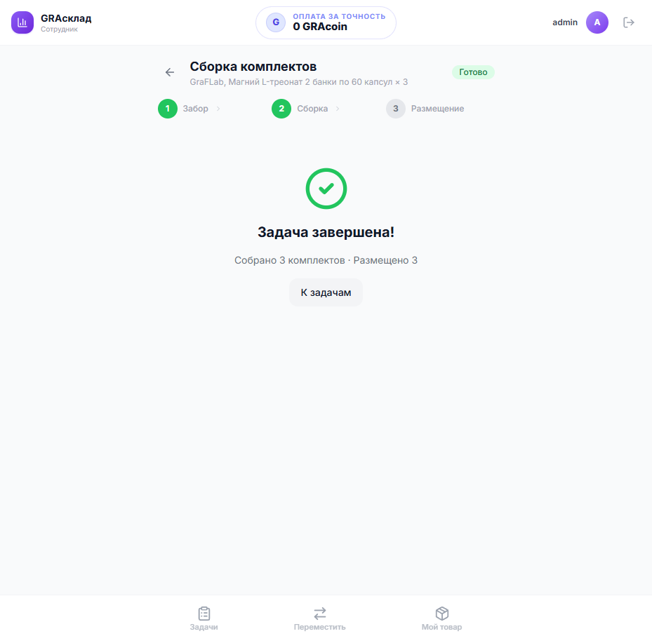
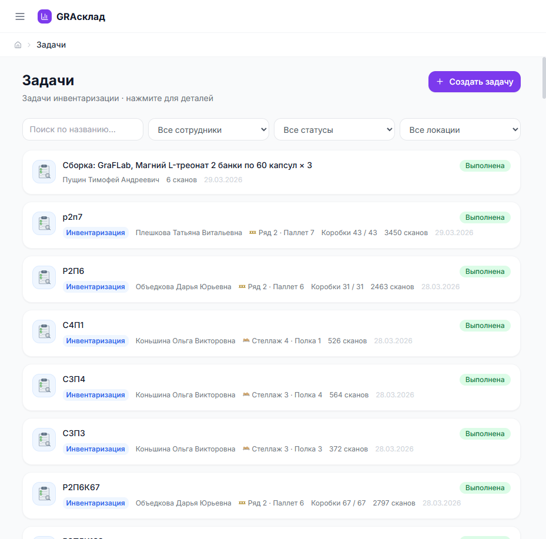

> **Не хватило места?** Нажмите "Сменить" и отсканируйте другую полку/паллет.

---

## Итого: что происходит с товаром

| Фаза | Откуда | Куда |
|------|--------|------|
| Забор | Коробка на паллете / полка | → На сотрудника |
| Сборка | На сотруднике | → В комплект (виртуально) |
| Размещение | На сотруднике | → На полку / паллет |

- Количество в коробке-источнике **уменьшается** при каждом скане забора
- Количество на полке-назначения **увеличивается** при каждом скане размещения
- Все перемещения фиксируются в разделе **"Перемещения"**
