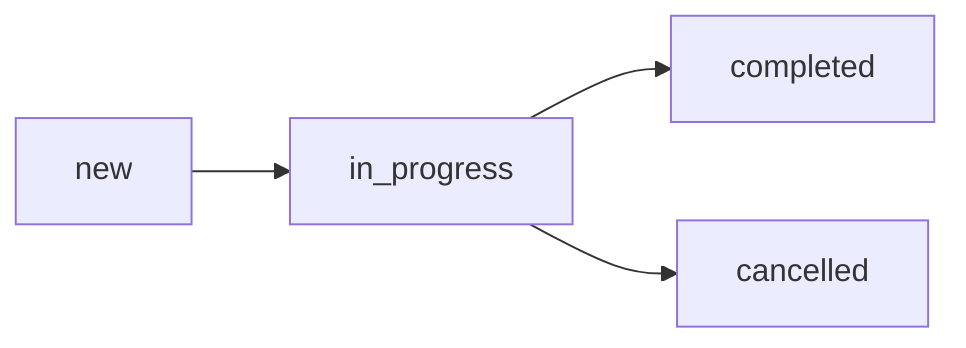

# Задачи

Фронтенд (admin): `TasksPage.jsx` (`/admin/tasks`).
Фронтенд (employee): `MyTasksPage.jsx` (`/employee/tasks`), `TaskScanPage.jsx` (`/employee/tasks/:id`).

API: `/api/tasks` — `backend/src/routes/tasks.js`.

## Типы задач (task_type)

| task_type | Описание |
|---|---|
| `inventory` | Инвентаризация — пересчёт товаров на полке/паллете |
| `packaging` | Упаковка — фасовка товаров в коробки (см. [[Упаковка]]) |
| `bundle_assembly` | Сборка комплектов — забор, сборка, размещение (см. [[Сборка комплектов]]) |

## Статусы

## Таблица inventory_tasks_s

| Поле | Описание |
|---|---|
| title | Название задачи |
| status | new / in_progress / completed / cancelled |
| task_type | inventory / packaging / bundle_assembly |
| employee_id | Назначенный сотрудник (FK employees_s) |
| shelf_id | Целевая полка (FK shelves_s) |
| shelf_ids | Массив полок для мульти-полочной задачи (JSONB) |
| current_shelf_index | Текущий индекс полки (для мульти-полки) |
| product_id | Товар (для упаковки) |
| box_size | Размер коробки (для упаковки) |
| target_pallet_id | Целевой паллет (FK pallets_s) |
| target_box_id | Целевая коробка (FK boxes_s) |
| target_shelf_box_id | Целевая коробка на полке (FK shelf_boxes_s) |
| packing_phase | Фаза упаковки |
| created_by | Кто создал (FK users_s) |
| notes | Заметки |

## Инвентаризация (inventory)

### Workflow

1. Админ/менеджер создаёт задачу, выбирает полку или несколько полок
2. Сотрудник начинает задачу (`POST /api/tasks/:id/start`)
3. Сканирует штрихкод полки для привязки
4. Сканирует товары (`POST /api/tasks/:id/scan`)
5. При ошибке — `POST /api/tasks/:id/report-error`
6. Мульти-полка: `POST /api/tasks/:id/next-shelf` (переход к следующей полке)
7. Завершение: `POST /api/tasks/:id/complete`

### Мульти-полка

Задача может включать несколько полок (`shelf_ids` — JSONB массив ID). Сотрудник последовательно инвентаризирует каждую полку, переключаясь через `next-shelf`. Текущая позиция хранится в `current_shelf_index`.

### Результат инвентаризации

- Сканирования записываются в `inventory_task_scans_s` (product_id, scanned_value, quantity_delta, shelf_id)
- Расхождения видны в [[Аналитика|аналитике]]
- Движения логируются в `shelf_movements_s`
- За каждое сканирование начисляются [[GRACoin]]

## Коробочные задачи

Одна задача может включать несколько коробок (`inventory_task_boxes_s`):
- `task_id` → задача
- `box_id` или `shelf_box_id` → целевая коробка
- `status`: pending → in_progress → completed
- Сканирования привязываются к `task_box_id`

## Ошибки сканирования

Таблица `scan_errors_s`:
- `scanned_value` — что отсканировали
- `employee_note` — заметка сотрудника
- `resolved_at` / `resolved_by` — когда и кем решена
- Просмотр: `GET /api/tasks/errors`, разрешение: `PUT /api/tasks/errors/:id/resolve`

## Аналитика задач

- `GET /api/tasks/stats/summary` — общая статистика
- `GET /api/tasks/analytics/summary` — детальная аналитика
- `GET /api/tasks/:id/analytics` — аналитика конкретной задачи

Подробнее: [[Аналитика]].

## Связи

- [[Упаковка]] — подтип задачи (task_type='packaging')
- [[Сборка комплектов]] — подтип задачи (task_type='bundle_assembly')
- [[GRACoin]] — начисления за сканирования
- [[Стеллажный склад]] / [[Паллетный склад]] — цели задач
- [[Аналитика]] — отчёты по инвентаризации
