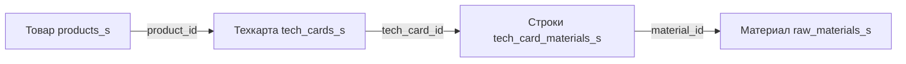

# Сырьё и материалы

Фронтенд: `MaterialsPage.jsx` (`/admin/products/materials`).

API: `/api/materials` — `backend/src/routes/materials.js`.

## Таблица raw_materials_s

| Поле | Тип | Описание |
|---|---|---|
| `external_id` | VARCHAR(255) | ID из МойСклад |
| `name` | VARCHAR(500) | Название |
| `code` | VARCHAR(255) | Код |
| `article` | VARCHAR(255) | Артикул |
| `unit` | VARCHAR(20) | Единица измерения (default: шт) |
| `category` | VARCHAR(30) | `ingredient` или `packaging` |
| `material_group` | VARCHAR(50) | Группа (порошки, полуфабрикаты, этикетки, смеси, расходники, другое) |
| `folder_path` | TEXT | Путь папки |
| `stock` | NUMERIC | Остаток |
| `buy_price` | NUMERIC(18,2) | Закупочная цена |
| `min_stock` | NUMERIC | Мин. запас |
| `supplier` | VARCHAR(500) | Поставщик |
| `notes` | TEXT | Заметки |
| `archived` | BOOLEAN | Архивный |
| `source_json` | JSONB | Данные из МойСклад |

## Категории

| category | Описание |
|---|---|
| `ingredient` | Ингредиенты для производства |
| `packaging` | Упаковочные материалы |

## Группы материалов (material_group)

Порошки, полуфабрикаты, этикетки, смеси, расходники, другое.

## Техкарты

Техкарта (`tech_cards_s`) — рецепт производства товара:
- Связь: `tech_cards_s.product_id` → `products_s.id` (UNIQUE)
- Строки: `tech_card_materials_s` — какие материалы и сколько нужно
- `output_quantity` — выход продукции
- `cost` — себестоимость

## Рецепты материалов

Материал может состоять из других материалов (`material_recipe_s`):
- `material_id` → конечный материал (полуфабрикат)
- `ingredient_id` → ингредиент
- `quantity` — количество
- `sort_order` — порядок

Пример: Полуфабрикат = ингредиент 1 + ингредиент 2 + ...

## API эндпоинты

| Метод | Путь | Описание |
|---|---|---|
| GET | / | Список (фильтры: category, material_group, search, archived) |
| GET | /stats | Статистика по категориям |
| GET | /:id | Детали с рецептами и техкартами |
| POST | / | Создать |
| PUT | /:id | Обновить |
| DELETE | /:id | Удалить |
| POST | /:id/recipe | Добавить ингредиент в рецепт |
| DELETE | /:id/recipe/:recipeId | Удалить ингредиент |

## Данные из МойСклад

Импорт через sync: остатки (`stock`), закупочные цены (`buy_price`), единицы (`unit`).

## Связи

- [[Товары]] — техкарты связывают товары с материалами
- [[МойСклад API]] — источник данных
