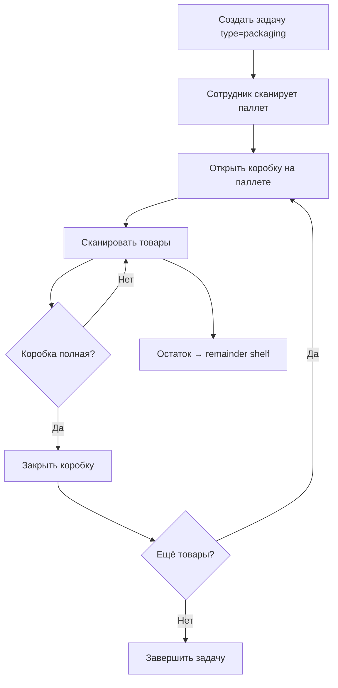

# Упаковка (Packaging)

## Workflow

## API последовательность

1. `POST /api/packing/:taskId/start` — начать упаковку
2. `POST /api/packing/:taskId/open-box` — открыть коробку
3. `POST /api/packing/:taskId/scan` — сканировать товар (повторять)
4. `POST /api/packing/:taskId/close-box` — закрыть коробку
5. Повторить 2-4 для следующих коробок
6. `POST /api/packing/:taskId/close-remainder` — закрыть остаток
7. `POST /api/packing/:taskId/complete` — завершить

## Параметры коробки

- `box_size` — макс. количество товаров (задаётся при создании задачи)
- `status`: open → closed
- `confirmed` — подтверждена
- `is_remainder` — неполная коробка

## Связи

- [[Паллетный склад]] — коробки создаются на паллетах
- [[Задачи]] — упаковка = тип задачи
- [[GRACoin]] — начисления за сканирования
