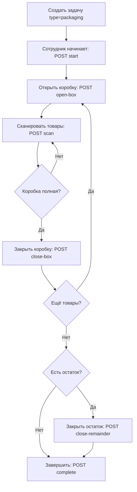

# Упаковка (Packaging)

Фронтенд: `PackagingPage.jsx` (`/employee/packaging/:id`).

API: `/api/packing` — `backend/src/routes/packing.js`.

Упаковка — это тип задачи (`task_type='packaging'`), управляемый отдельным набором эндпоинтов.

## Workflow

## API последовательность

1. `POST /api/packing/:taskId/start` — начать упаковку
2. `POST /api/packing/:taskId/open-box` — открыть новую коробку
3. `POST /api/packing/:taskId/scan` — сканировать товар (повторять до заполнения)
4. `POST /api/packing/:taskId/confirm-box` — подтвердить коробку
5. `POST /api/packing/:taskId/close-box` — закрыть коробку
6. Повторить 2-5 для следующих коробок
7. `POST /api/packing/:taskId/close-remainder` — закрыть неполную коробку (остаток)
8. `POST /api/packing/:taskId/complete` — завершить упаковку

Дополнительно:
- `GET /api/packing/:taskId` — текущее состояние задачи
- `GET /api/packing/:taskId/boxes` — список коробок задачи
- `GET /api/packing/:taskId/remainder-shelf` — полка для остатков
- `POST /api/packing/:taskId/cancel-box` — отменить коробку

## Параметры задачи

При создании задачи упаковки указываются:
- `product_id` — товар для упаковки
- `box_size` — макс. количество товаров в коробке (default: 50)
- `target_pallet_id` — паллет для размещения коробок

## Параметры коробки

- `box_size` — макс. количество товаров
- `status`: open → closed
- `confirmed` — подтверждена сотрудником
- `is_remainder` — неполная коробка
- `remainder_shelf_id` — полка, куда перенесён остаток

## Связи

- [[Паллетный склад]] — коробки создаются на паллетах (`boxes_s`)
- [[Стеллажный склад]] — остатки могут переноситься на полки
- [[Задачи]] — упаковка = тип задачи
- [[GRACoin]] — начисления за сканирования
